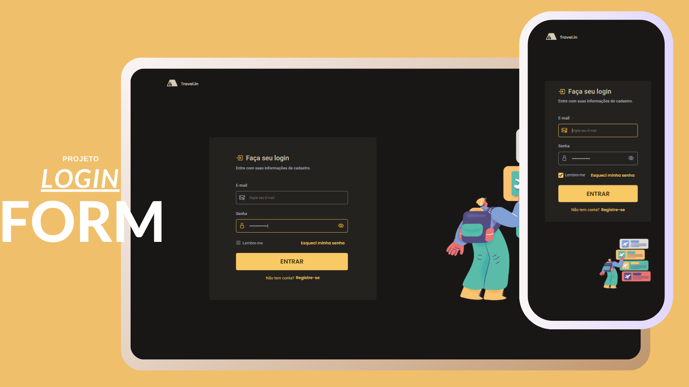

<h1 align="center">#8 Login Form </h1>
<h2 align="center">Formulário de Login</h2>

  working...

  <a href="#-tecnologias">Tecnologias</a>&nbsp;&nbsp;&nbsp;|&nbsp;&nbsp;&nbsp;
  <a href="#-projeto">Projeto</a>&nbsp;&nbsp;&nbsp;|&nbsp;&nbsp;&nbsp;
  <a href="#-layout">Layout</a>&nbsp;&nbsp;&nbsp;|&nbsp;&nbsp;&nbsp;
  <a href="#-instruções-de-cadastro">Instruções de Cadastro</a>

  

 

  

## 🚀 Tecnologias

Esse projeto foi desenvolvido com as seguintes tecnologias:

- HTML e CSS
- Git e Github
- Figma e Canva para design

## 💻 Projeto

xxxxxxx

## 🎨 Layout

Você pode visualizar o layout do projeto através [DESSE LINK](). 

## 🔍 Instruções do Site

1. Acesse o [Form](<https://jasonaraujo1.github.io/projeto-switcher-sidebar-countdown/>). 
2. 
3. 
4.

xxxxxxxxxxxxxxxx

## :memo: Licença

Esse projeto está sob a licença MIT.

---

Instruções pela [Sua Empresa/Equipe](https://seusite.com) :wave: [Participe da nossa comunidade!](https://discord.gg/sua-comunidade)
